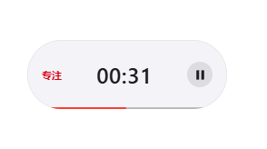
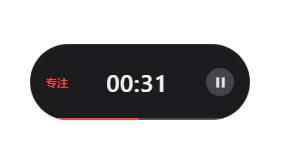
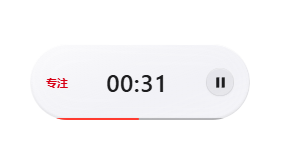
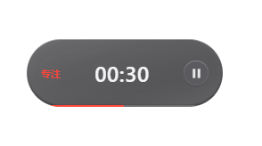
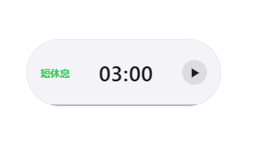
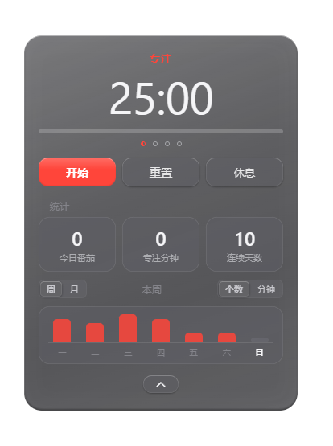
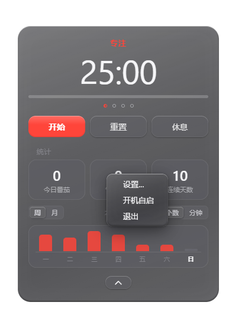
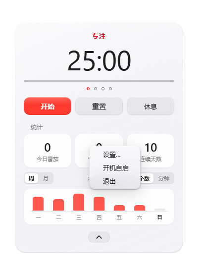
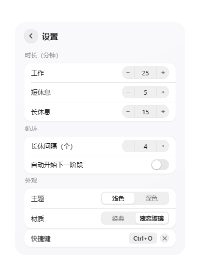

# 番茄钟（pomodoro-clock）

一个简洁、好用的 Windows 桌面番茄时钟。安装包只有 2 MB，迷你胶囊常驻桌面，专注/休息自动流转，统计全部本地保存——无账号、无云端、无打扰。

## 功能

- **迷你胶囊悬浮窗**：无边框、置顶、可拖拽；倒计时 + 阶段色标签 + 播放/暂停，底部细进度条实时显示阶段进度
- **单击展开统计面板**：开始/暂停/重置/跳过；今日番茄、专注分钟、连续天数；本周每日柱状图
- **阶段自动流转**：工作 → 短休 → 工作……每 4 个番茄进入长休（间隔可调）；完成时系统通知 + 轻提示音
- **托盘驻留**：关闭窗口 = 隐藏到托盘继续计时，托盘菜单含暂停/重置/设置/退出；支持开机自启；单实例运行
- **全局热键**：默认 `Ctrl+Alt+O` 随时唤回，可自定义改键
- **双主题 × 双材质**：浅色/深色主题，经典/液态玻璃材质自由组合
- **可配置**：工作/短休/长休时长、长休间隔、自动开始下一阶段，全部持久化到 `config.json`
- **统计本地存储**：`stats.json` 存 exe 同目录，无云端、无账号

## 界面预览

迷你胶囊的材质 × 主题四种组合：

| 经典 · 浅色 | 经典 · 深色 | 液态玻璃 · 浅色 | 液态玻璃 · 深色 |
|:---:|:---:|:---:|:---:|
|  |  |  |  |

| 迷你胶囊 · 短休息 |
|:---:|
|  |

| 统计面板（深色） | 面板 + 右键菜单（深色） |
|:---:|:---:|
|  |  |

| 面板 + 右键菜单（浅色） | 设置抽屉 |
|:---:|:---:|
|  |  |

## 安装

从 [Releases](https://github.com/wzejia/pomodoro-clock/releases) 下载最新 `pomodoro-clock_x.x.x_x64-setup.exe`（NSIS 安装包，约 2.2 MB），安装后开箱即用。

## 从源码构建

```bash
bun install
bun run tauri dev      # 开发调试
bun run tauri build    # 产出 NSIS 安装包
```

测试：`cd src-tauri && cargo test`（45 个，全绿基线）

## 结构

| 位置 | 作用 |
|---|---|
| `src-tauri/src/timer.rs` | 计时状态机（唯一计时真相，全单测覆盖） |
| `src-tauri/src/stats.rs` | 记录、聚合（今日/本周/连签）、JSON 存取 |
| `src-tauri/src/appconfig.rs` | 配置读写（时长/热键/主题/材质/自启） |
| `src-tauri/src/lib.rs` | IPC 命令、tick 线程、通知、托盘、单实例 |
| `src/main.ts` | 迷你窗 + 面板 UI 渲染与事件转发（无计时逻辑） |
| `src/tray-menu.ts` | 托盘自绘菜单 UI |
